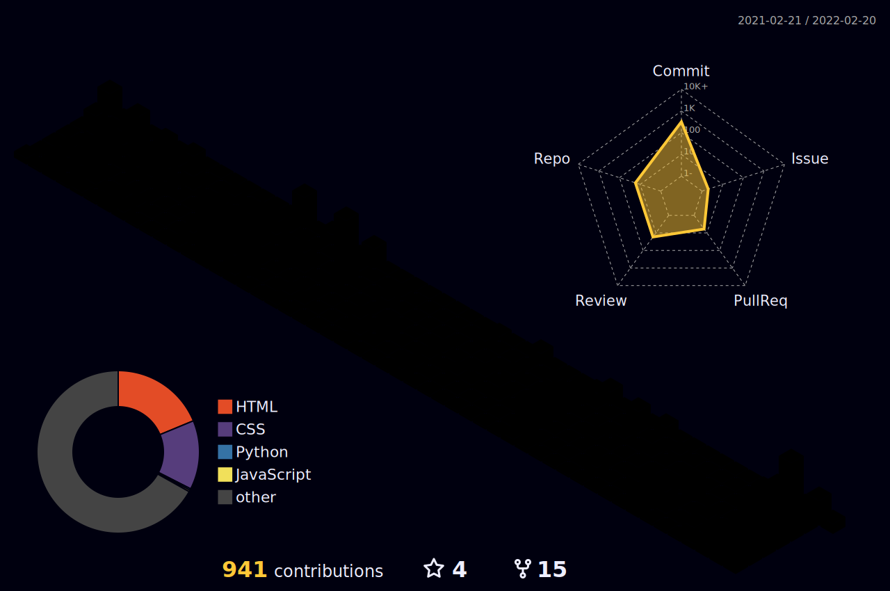

<h1 align="center">🌟 Howdy Folks's 😎</h1> 

<a href="https://github.com/rithiksarab"></a>

- 👋 I’m `@rithiksarab` 😇
- 👀 Interested in `WebDev` currently with a focus on `Frontend` ✌️
- 🌱 Learning all about [ThreeJS](https://threejs.org/ "ThreeJS's Homepage") 🍃
- 💞️ I’m looking to collaborate on `Open Source` projects ✨
- 👨‍🦰 Pronouns: `he/him` 👨‍💻
- 🧠 Beginner Mindset `Open for :.earning`⚡️
- ⚙️ I use daily: `.js`, `.html`, `.css`, `.svg` 😈
- 🎉 Fun fact: My first line of code was not `"Hello World!"` 😜
- :octocat: I'm a `GitHub` user 😬
- ⏳ At off hours `Netflix` 📺
- ❣️ to `sleep` 💤

<p align="center">
💥💥 
</p>

<hr>

<p align="center">
  
  
  
</p>





🗓️ Weekly Coding Stat's 📊
<!--START_SECTION:waka-->


**I'm an Early 🐤** 

```text
🌞 Morning    156 commits    █████░░░░░░░░░░░░░░░░░░░░   21.0% 
🌆 Daytime    284 commits    █████████░░░░░░░░░░░░░░░░   38.22% 
🌃 Evening    149 commits    █████░░░░░░░░░░░░░░░░░░░░   20.05% 
🌙 Night      154 commits    █████░░░░░░░░░░░░░░░░░░░░   20.73%

```
📅 **I'm Most Productive on Sunday** 

```text
Monday       97 commits     ███░░░░░░░░░░░░░░░░░░░░░░   13.06% 
Tuesday      87 commits     ███░░░░░░░░░░░░░░░░░░░░░░   11.71% 
Wednesday    88 commits     ███░░░░░░░░░░░░░░░░░░░░░░   11.84% 
Thursday     95 commits     ███░░░░░░░░░░░░░░░░░░░░░░   12.79% 
Friday       111 commits    ███░░░░░░░░░░░░░░░░░░░░░░   14.94% 
Saturday     61 commits     ██░░░░░░░░░░░░░░░░░░░░░░░   8.21% 
Sunday       204 commits    ██████░░░░░░░░░░░░░░░░░░░   27.46%

```


📊 **This Week I Spent My Time On** 

```text
⌚︎ Time Zone: Asia/Kolkata

💬 Programming Languages: 
YAML                     3 hrs 39 mins       █████████████░░░░░░░░░░░░   51.94% 
Markdown                 2 hrs 40 mins       █████████░░░░░░░░░░░░░░░░   38.08% 
HTML                     27 mins             █░░░░░░░░░░░░░░░░░░░░░░░░   6.6% 
TypeScript               8 mins              ░░░░░░░░░░░░░░░░░░░░░░░░░   1.95% 
JSON                     5 mins              ░░░░░░░░░░░░░░░░░░░░░░░░░   1.23%

🐱‍💻 Projects: 
rithik112                5 hrs 33 mins       ███████████████████░░░░░░   79.09% 
rithiksarab              46 mins             ██░░░░░░░░░░░░░░░░░░░░░░░   11.13% 
BalaSwecha               41 mins             ██░░░░░░░░░░░░░░░░░░░░░░░   9.79%

```

**I Mostly Code in HTML** 

```text
HTML                     24 repos            ███████░░░░░░░░░░░░░░░░░░   29.27% 
JavaScript               16 repos            █████░░░░░░░░░░░░░░░░░░░░   19.51% 
TypeScript               14 repos            ████░░░░░░░░░░░░░░░░░░░░░   17.07% 
CSS                      14 repos            ████░░░░░░░░░░░░░░░░░░░░░   17.07% 
Java                     4 repos             █░░░░░░░░░░░░░░░░░░░░░░░░   4.88%

```


 Last Updated on 07/02/2022 19:23:49 UTC
<!--END_SECTION:waka-->

----

<details align='center'>
  <summary> <b> 🎶 Wanna Groove on Same Tracks ⁉️🎸</b> </summary>
  <br>
  <p align="center">
    
    
  </p>
</details>

----
